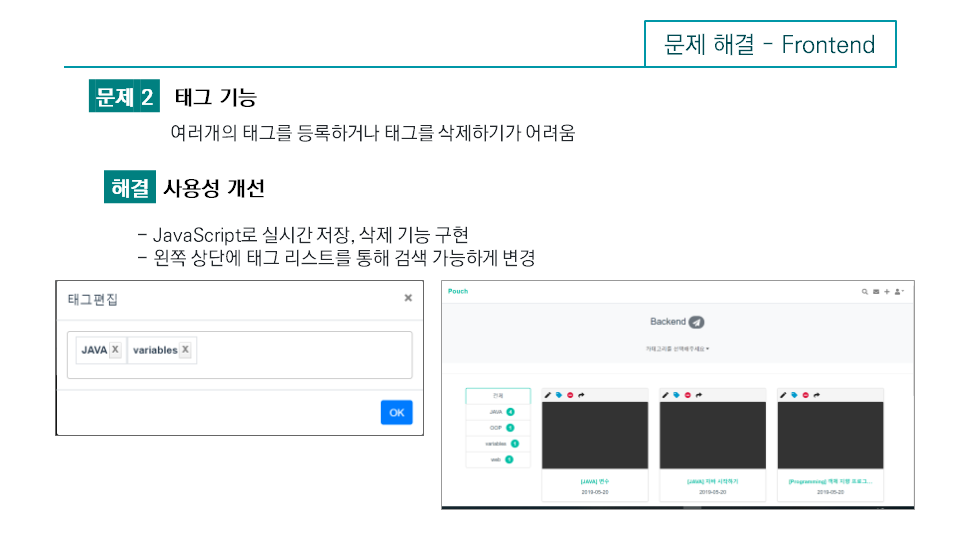
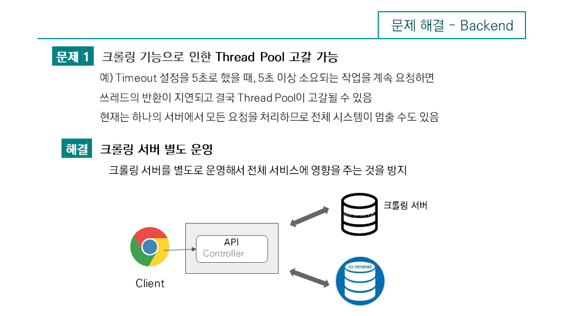
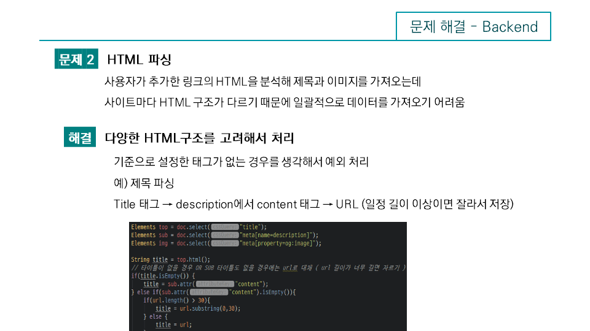
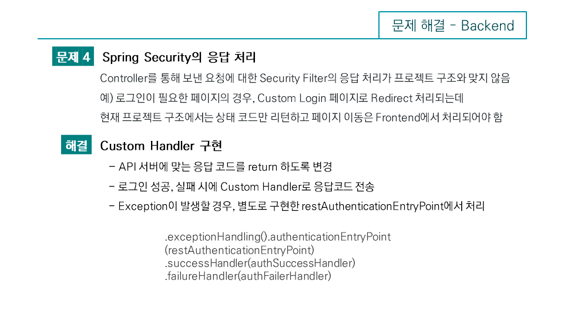
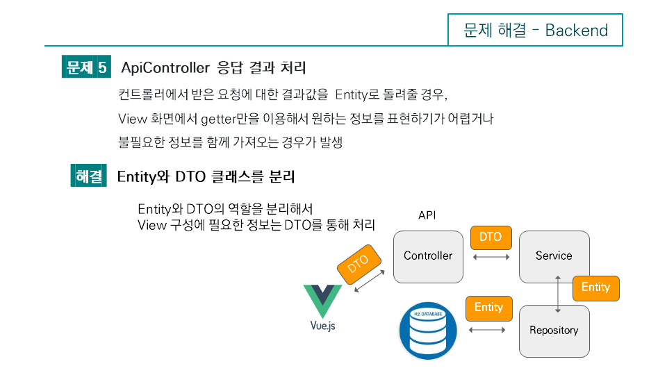

# pouch 
# 소개
사용자가 웹사이트를 저장, 관리, 공유 할 수 있는 북마크 서비스

#### [주소]: https://15.164.26.183:8080

## 기술스택
* Spring Boot 2.0
* JPA
* Maven
* Spring Security
* Vue.js
* Vuex
* Chrome Extension
* Bootstrap 4

## 팀구성
* 백엔드 개발자 2명

## 문제해결

### 메인 페이지 

* 문제점 : view 화면을 Thymeleaf를 사용하다가 동적인 페이지를 구현할 때 js와 html 소스가 섞여서 유지보수에 문제가 생김. 

* 해결 : Vue.js 도입으로 SPA 페이지로 변경함. Vue CLi를 통해 html과 js 코드를 분리하고, axios와 axios interceptors 
기능을 통해서 REST API 응답에 따른 공통 처리를 함.

### 태그 기능 구현

* 문제점 : 태그 등록을 여러개 하거나, 삭제하기가 힘듬. 검색기능과 태그를 둘다 사용하기 복잡하고, 코드가 복잡해졌음.

* 해결 :  javascript로 실시간 저장, 삭제 기능 구현. 검색기능과 분리 및 태그로 왼쪽상단에 태그 리스트를 통해 검색가능하게 변경

### 유효성 검사 문제

* 문제점 : 프론트단에서 기본적으로 해야하는 유효성 검사 코드가 지속적으로 중복이 됨
* 해결 : vee-validate 도입, 기본적으로 input tag로 인자값을 전달 할 경우 모두 vee-validate를 거쳐서 처리하게 변

### 크롤링(링크추가) 및 로그인(인증) 기능 

* 문제점 : 링크를 추가시 썸네일과 타이틀이 없으면 사용자가 북마크를 저장후 따로 지정해줘야하는 불편, 링크를 추가할려면 사이트로 다시 가야하는 점 등의 문제가 생겼음. 
또한 Vue.js 도입후에 인증여부를 프론트에서 확인하지 못하면 페이지 및 리소스 접근을 권한에 따라서 나누는게 불가능해짐.

* 해결 : 링크를 추가할 때 크롤링을 통해서 타이틀과 썸네일을 확인. html 파싱을 통해서 가져올게 없으면 입력한 URL값과 기본 이미지로 등록되게 변경, 간단하게 북마크 기능을 사용할 수 있게 크롬 익스텐션 도입( 원클릭으로 북마크를 저장할 수 있게 ) 인증여부는 router 에서 페이지 이동전에 인증여부를 확인하고, 그에 따라 어떤 페이지로 이동될 것인지 결정 ( 인증이 되어있지 않으면 로그인 페이지로, 권한이 부족할 경우 접근불가후 이전페이지로 이동 ) 

* 필요 후속조치 : 크롤링의 속도 문제, Vue-CLi로 만든 어플리케이션은 검색엔진최적화가 어려움. Nuxt.js 도입 고려
 
* 프로젝트 관리 
* 버전관리 : Git, Github 및 Source tree ( git flow, code review )
* 문서화 : REST API, 작업한 내용 및 테스트 문서 점검
* 커뮤니케이션 : 일주일에 한번씩 코드 리뷰, 필요에 따라 페어프로그래밍 진행
* 배포 : Travis CI를 통한 자동배포 ( 예정 )
