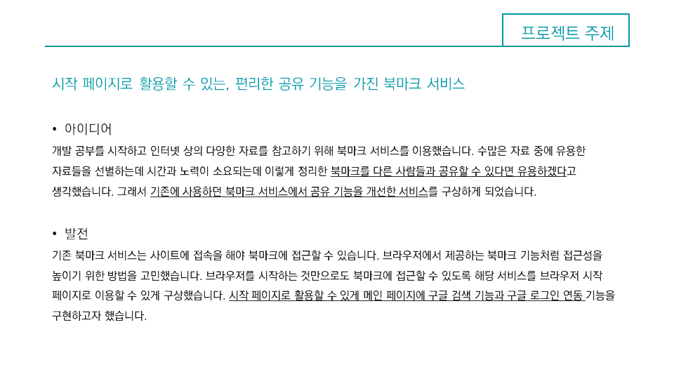
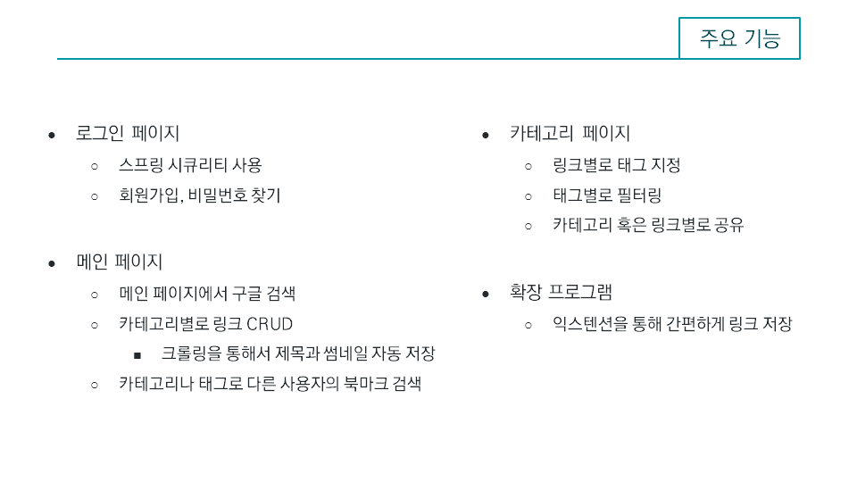
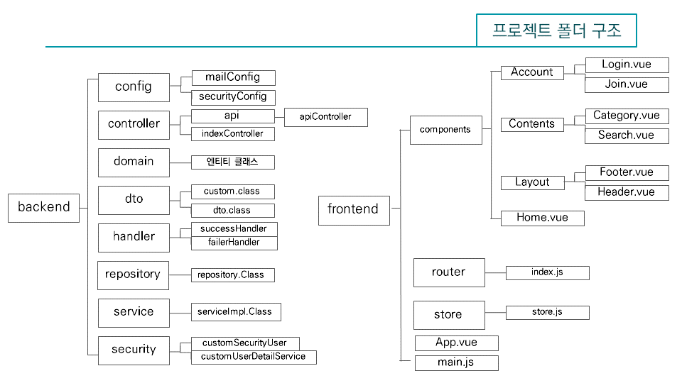
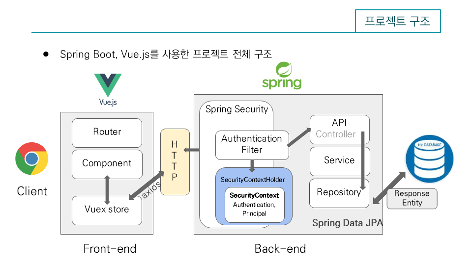
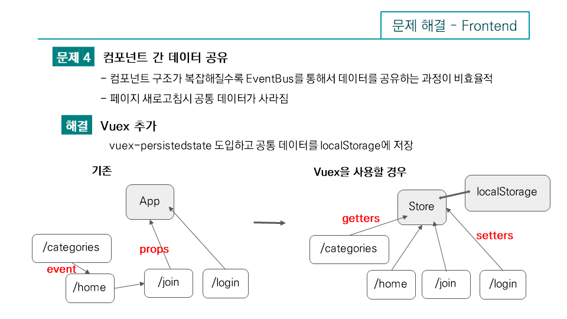

### [POUCH 바로가기](http://15.164.26.183:3000)

테스트 아이디
* id : jaehee0145@gmail.com
* pw : 1234

## 실행 방법
```
git clone https://github.com/choiwono/pouch.git

cd pouch/backend

mvn clean install

java -jar target/pouch-0.0.1-SNAPSHOT.jar

localhost:3000 으로 접속
```

## 크롬 익스텐션 사용하기

### [확장도구 추가](https://chrome.google.com/webstore/detail/save-to-pouch/cfohoadkcbnieeiifnkdblhefgeopfac/related?utm_source=chrome-ntp-icon)

```

로그인이 필요합니다. 카테고리를 추가하거나, 확장도구에서 추가하신뒤에 카테고리를 선택하고 
저장버튼을 누르면 현재 URL에 해당하는 링크가 저장이 됩니다.

```

개발: :smiley: [최원오](https://github.com/choiwono) :heart_eyes: [박재희](https://github.com/jaehee0145)













* 필요 후속조치 : 크롤링의 속도 문제, Vue-CLi로 만든 어플리케이션은 검색엔진최적화가 어려움. Nuxt.js 도입 고려
 
* 프로젝트 관리 
* 버전관리 : Git, Github 및 Source tree ( git flow, code review )
* 문서화 : REST API, 작업한 내용 및 테스트 문서 점검
* 커뮤니케이션 : 일주일에 한번씩 코드 리뷰, 필요에 따라 페어프로그래밍 진행
* 배포 : Travis CI를 통한 자동배포 ( 예정 )
